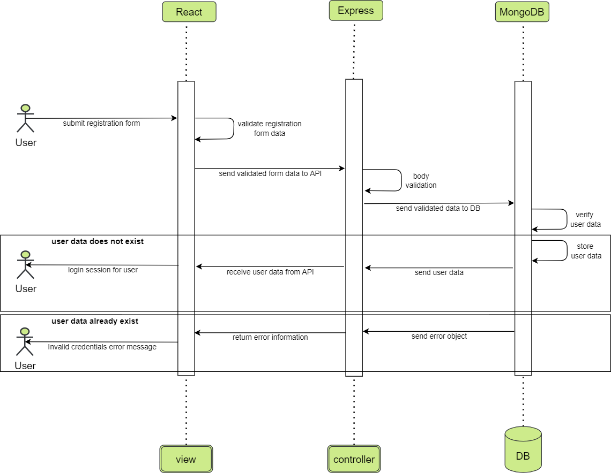
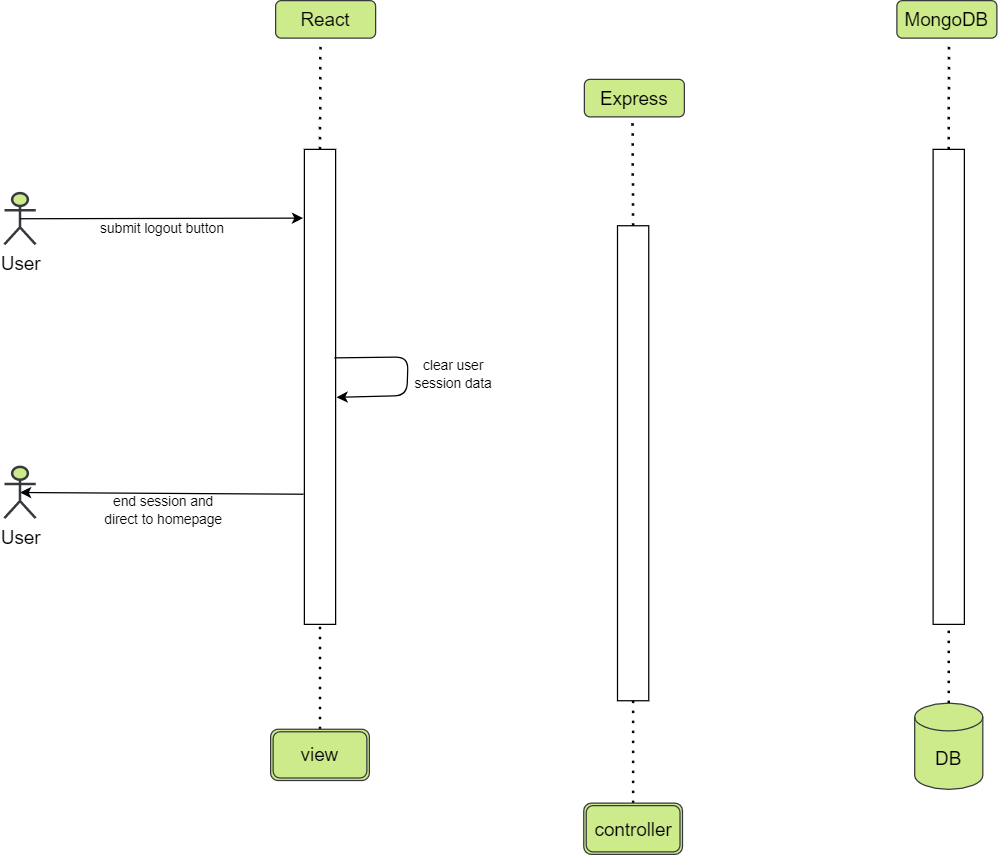
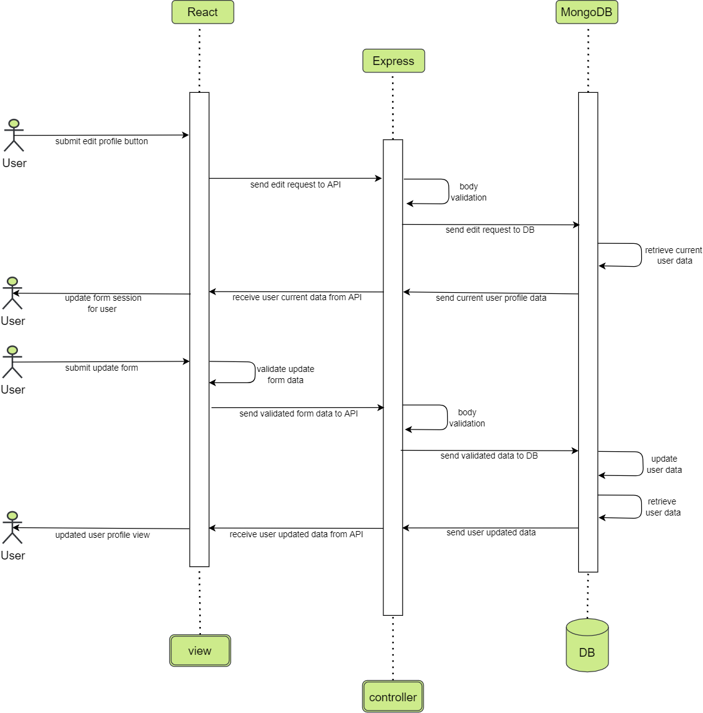
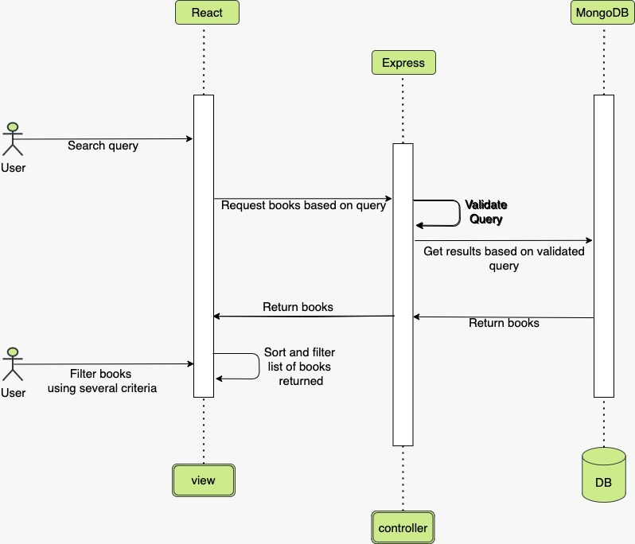
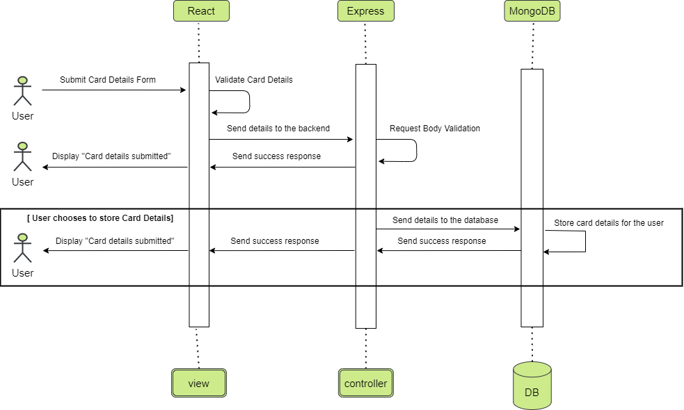
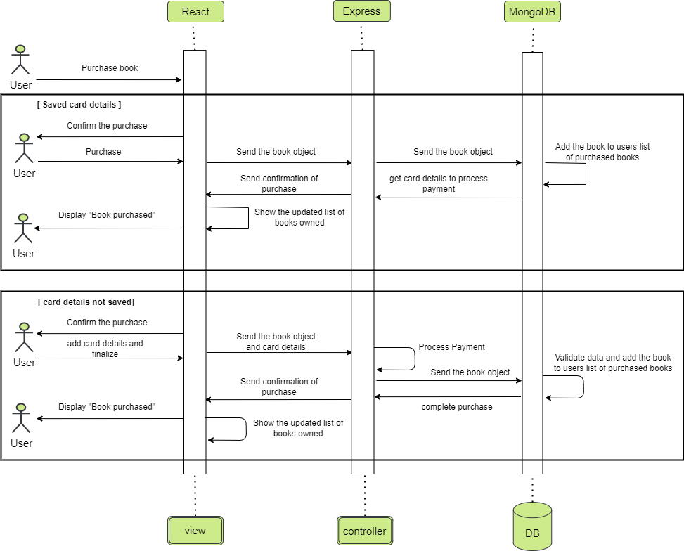
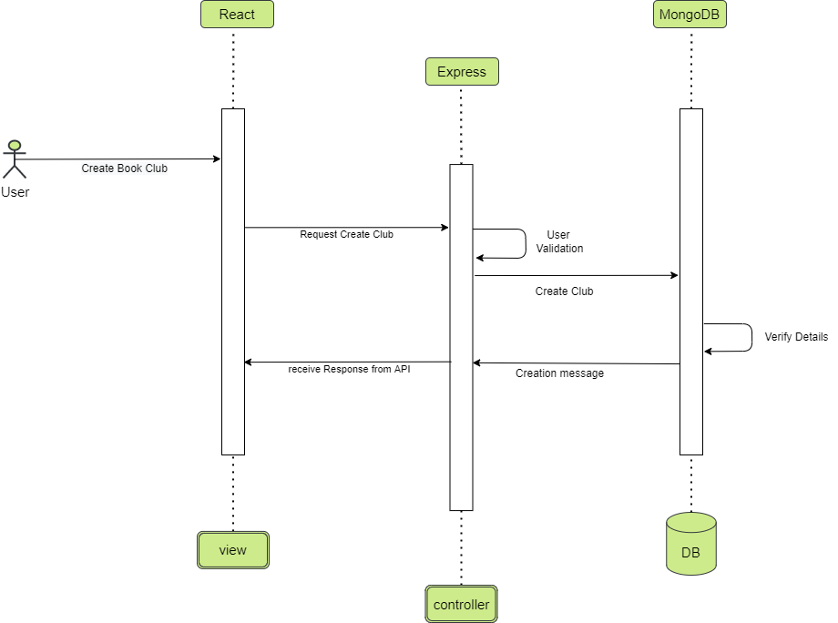
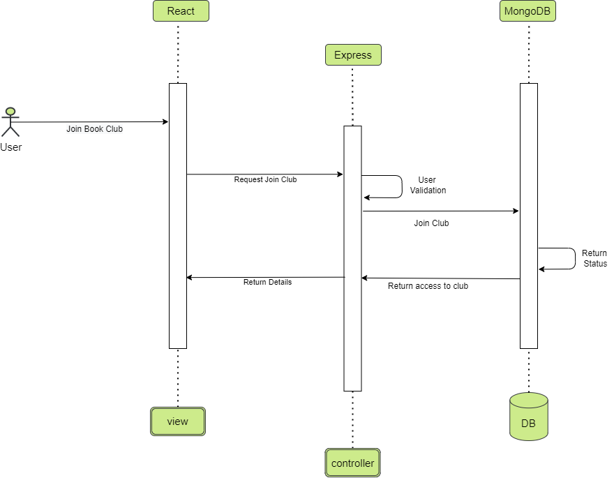
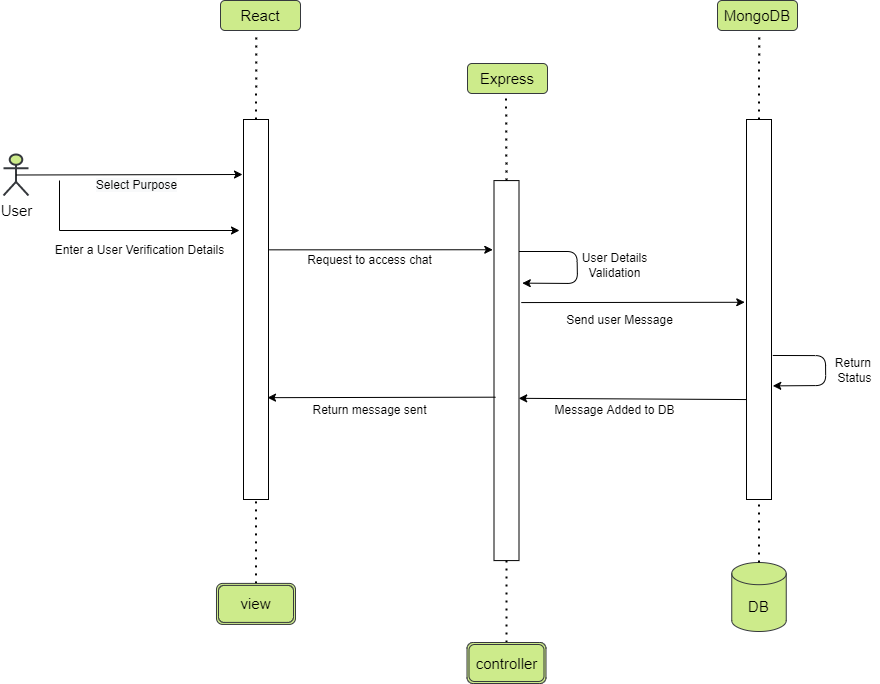

# Class API Diagram

This is the API overview and models.

  
  
  
# Architectural Diagram
## Core Feature: User Profile

- ### User Story: As a new user, I should be able to register by creating a username and a password so that the system can remember me and my data.
  

- ### User Story: As a registered user, I should be able to log in with my credentials every time so that I can access the information specific to me.
  

- ### User Story: As a user, I should be able to logout of the application so that I may restrict others from using my account.
  

- ### User Story: As a user, I should be able to edit my profile that I could update my personal information. (i.e., Name, bio, photo).
  

## Core Feature: Search ebook

- ### User Story: As a user, I should be able to apply filters to the search (i.e., Rent books, year of published, author name) so that I may easily see what books I want to read.
  
  
  
- ### User Story: As a user, I should be able to search the book by its title so that I could easily find them or add to my library list.  
  

## Core Feature: Buy/rent ebook

- ### User Story: As a user, I want to be able to choose whether to remember my payment method or just use it once because of security concerns.
   

- ### User Story: As a user, I should be able to buy a book so that I could have a lifetime access to that book
    

## Core Feature: create/join book club

- ### User Story: As a user, I should be able to create book club so that I may be able to invite other people to share my view and opinion on a specific book.
    
   
   
- ### User Story: As a user, I should be able to join book club so that I may be able to know more detail about the people thoughts on a specific book.
   
   
   
- ### User Story: As a user, I should be able to chat with other user so that I may be able to communicate better.
   

